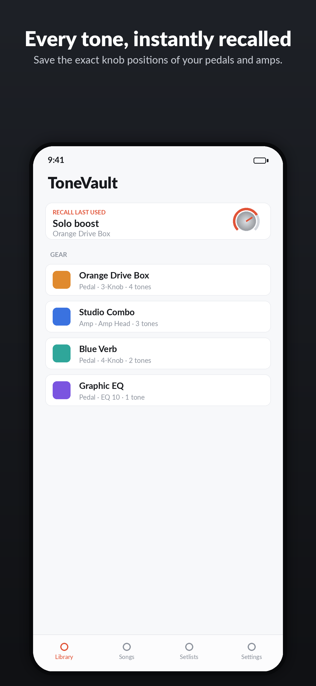
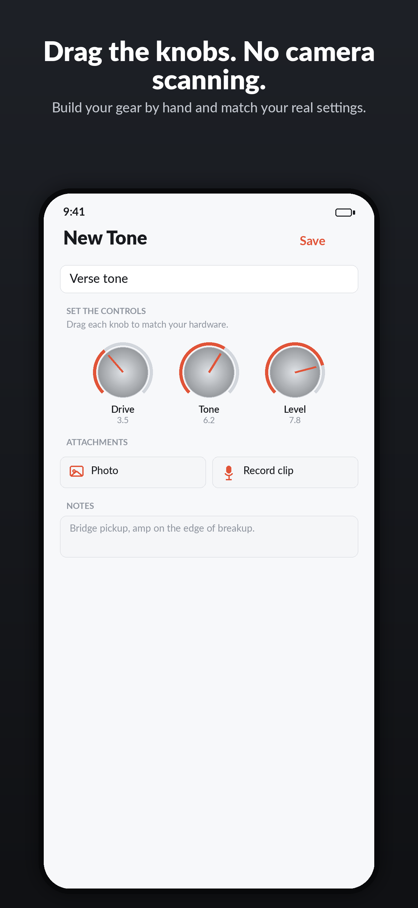
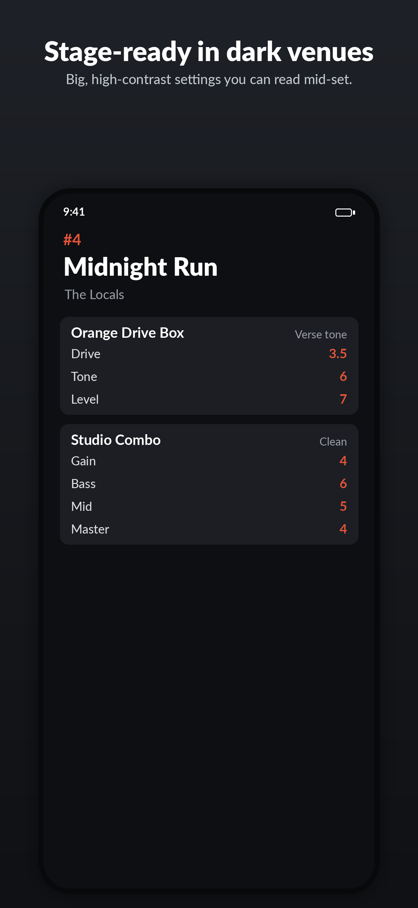

# ToneVault

Save the **exact knob positions** of your guitar pedals and amps, organized by song and setlist, so you can always recall a tone after tweaking.

**100% offline. No account. No cloud. No camera scanning.** Works in a windowless studio in airplane mode. Your data is yours forever.

<p align="center">
  
  
  
</p>

## What it does
- Build each pedal/amp by **picking a generic control layout** and **dragging virtual knobs, faders, and switches** to match your real hardware — no photo/AI scanning.
- Save tones instantly; **clone** to make a variant in one tap.
- Group tones into **Songs**, and songs into **Setlists** with a big, high-contrast **stage view** for dark venues.
- **Own your data:** one-tap whole-database backup/restore and PDF rig cheat-sheets. Backup/export is always free.
- One-time **$5.99** Pro unlock (no subscription) for unlimited gear/tones and audio/PDF extras.

## Stack
- Swift 5.10, SwiftUI, iOS 17+
- SwiftData (local-only; CloudKit-compatible models, sync intentionally off)
- StoreKit 2 (one-time non-consumable)
- No third-party dependencies

## Project layout
```
ToneVault/
├─ project.yml                 # XcodeGen project (source of truth; .xcodeproj is gitignored)
├─ Configuration/              # Info.plist, entitlements, PrivacyInfo.xcprivacy, StoreKit config
├─ ToneVault/
│  ├─ App/                     # App entry + ModelContainer
│  ├─ Models/                  # Gear, ToneSetting, ControlValue, Song, Setlist, templates
│  ├─ Store/                   # EntitlementManager (StoreKit 2)
│  ├─ Persistence/             # FileStorage, BackupService, PDFExportService
│  ├─ Views/                   # Library, Gear, Controls (drag knobs), Songs, Setlists, Paywall, Settings
│  └─ Assets.xcassets/         # App icon + accent color
├─ ToneVaultTests/             # Unit tests (see Docs/TESTPLAN.md)
├─ Marketing/                  # Screenshot generator + 6 App Store screenshots
├─ docs/privacy.html           # Free-hostable privacy page (GitHub Pages)
└─ Docs/                       # SUBMISSION, DECISIONS, TESTPLAN, ASO, PRIVACY_POLICY
```

## Build & run
```bash
brew install xcodegen
xcodegen generate
open ToneVault.xcodeproj
```
Set your Team ID in `project.yml` (`DEVELOPMENT_TEAM`) and pick your team under Signing. The scheme is wired to `Configuration/ToneVault.storekit`, so the paywall/purchase/restore work in the Simulator with no sandbox account.

Run tests with `⌘U` or:
```bash
xcodebuild test -scheme ToneVault -destination 'platform=iOS Simulator,name=iPhone 15'
```

## Shipping it
See **[Docs/SUBMISSION.md](Docs/SUBMISSION.md)** — a step-by-step App Store checklist covering the IAP, the "Data Not Collected" privacy label, free privacy-policy hosting (no domain needed), export compliance, screenshots, and every known rejection trigger.

## Legal
Generic control templates only — **no bundled brand database, no manufacturer logos**. Gear names are entered by the user. Not affiliated with or endorsed by any pedal or amplifier manufacturer. Terms of Use = Apple's standard EULA.

---

_Working name; rename freely. Bundle ID placeholder is `com.yourorg.tonevault`._
